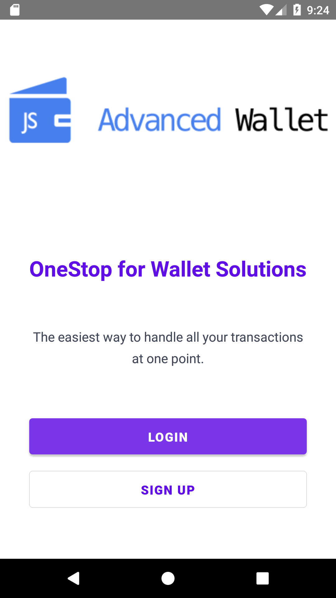
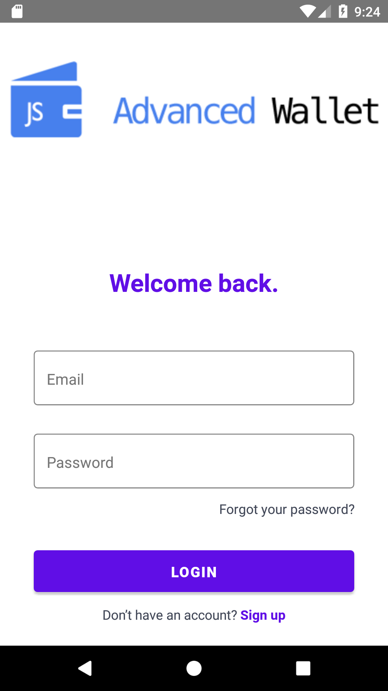
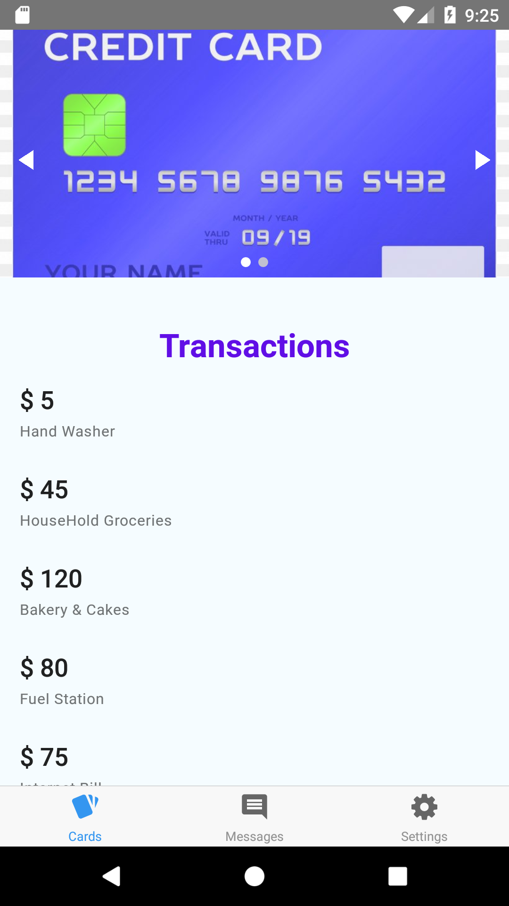
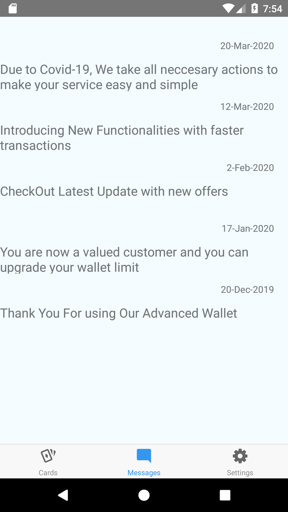
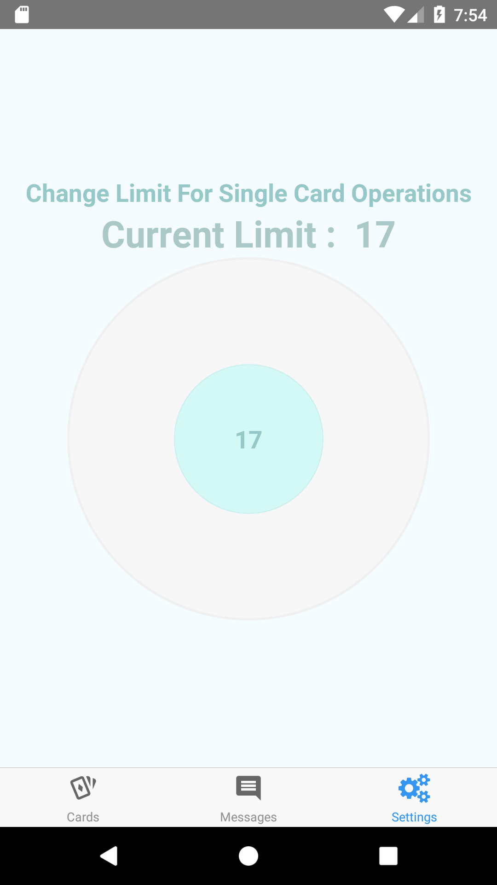
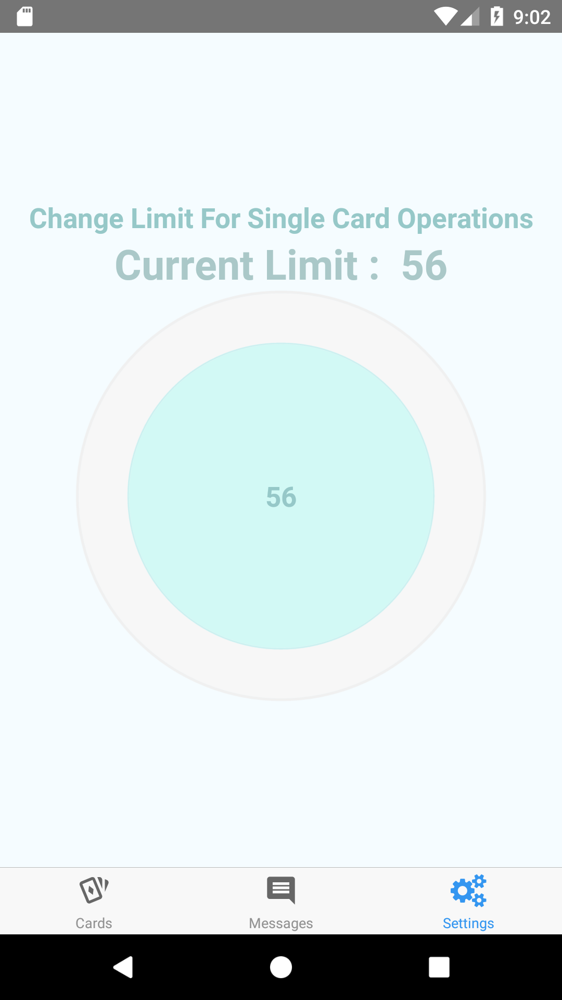

# AdvancedWallet-ReactNative


- [AdvancedWallet-ReactNative](#advancedwallet-reactnative)
- [Overview](#overview)
- [Set up MFP Server and configure MFP CLI](#set-up-mfp-server-and-configure-mfp-cli)
- [Usage](#usage)

<!-- <p float="float">
     
     
     
     
     
     
     
        
         
</p> -->


<div style="text-align: center"><table><tr>
  <td style="text-align: center">
         </a>
</td>
<td style="text-align: center">
         </a>
</td>

<td style="text-align: center">
         </a>
</td>

</tr></table></div>


<div style="text-align: center"><table><tr>

  <td style="text-align: center">
         </a>
</td>
  <td style="text-align: center">
         </a>
</td>

  <td style="text-align: center">
         </a>
</td>
</tr></table></div>


# Overview

In This Demo app , we use React native Advanced Wallet, where user can Authenticate login With MFP server and if successful they can start the wallet transactions.

This Wallet App list all the cards transactions,  notifications messages, and we can set the transactions per day limit

We will be utilizing the IBM services:

- Mobile Foundation
- JSON Store
- Push Notifications


# Set up MFP Server and configure MFP CLI


- Start MobileFirst Server instance locally by downloading the [Developer Kit](https://mobilefirstplatform.ibmcloud.com/downloads/#developer-kit) and [installing](https://mobilefirstplatform.ibmcloud.com/tutorials/en/foundation/8.0/installation-configuration/development/mobilefirst/installation-guide/) it on your workstation.
- the default url would be http://localhost:9080 and username/password would be admin/admin .

```
[06:04:17] root: AdvancedWallet-ReactNative > mfpdev server add
? Enter the name of the new server profile: devserver
? Enter the fully qualified URL of this server: http://localhost:9080
? Enter the MobileFirst Server administrator login ID: admin
? Enter the MobileFirst Server administrator password:
? Enter the context root of the MobileFirst administration services: mfpadmin
? Enter the MobileFirst Server connection timeout in seconds: 30
? Make this server the default?: Yes
Verifying server configuration...
The following runtimes are currently installed on this server: mfp
Server profile 'devserver' added successfully.

[06:05:00] root: AdvancedWallet-ReactNative > mfpdev server info

Name         URL
---------------------------------------------------
local        http://192.168.1.4:9080
charan       http://9.109.207.198:9080
devserver    http://localhost:9080       [Default]
---------------------------------------------------
```


#  Usage

1. From the command-line window, navigate to the project's roots folder and run the commands:
 - `npm install` - to install project dependencies.
 - `react-native link` - to link libraries to respective platforms based on dependencies.

2. From a command-line window, navigate to the platforms's root folder (either iOS or Android)  and run the commands:
 - `mfpdev app register` - to register the application.
 
3. From the command-line window, navigate to the project's roots folder and run the command:
 - `react-native run-ios` or `react-native run-android` - to run the application in an iOS Emulator or Android Simulator.

4. Press the `Login` Button to land on Login Page and enter valid details and if successful coneection established with MFP then We land on the Dashboard page where we can see the tabs with `cards`,`messages` & `settings`.


<!-- # Pre-requisites and Setup
- <a href="#step1">Setup Ionic and MFP CLI</a>
- <a href="#step2">Set up MFP Server  and configure MFP CLI
</a>
- <a href="https://appsody.dev/docs/getting-started/installation/">Appsody</a> -->


**Note**: If you are on Windows, instead of using `sudo`, run the above command (and the ones below) in a command prompt opened in administrative mode.


> Note: Please refer MFP documentation for compatible versions of Cordova - https://mobilefirstplatform.ibmcloud.com/tutorials/en/foundation/8.0/application-development/sdk/cordova/


* Install IBM MobileFirst Platform CLI
```
$ sudo npm install -g mfpdev-cli
$ mfpdev --version
8.0.0-2018121711
```
